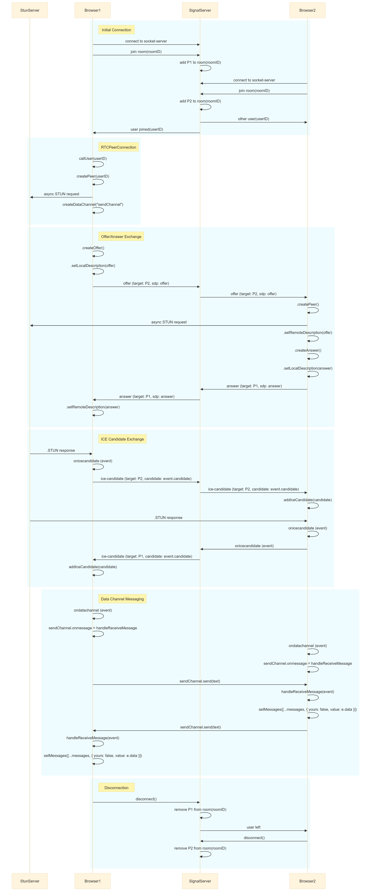
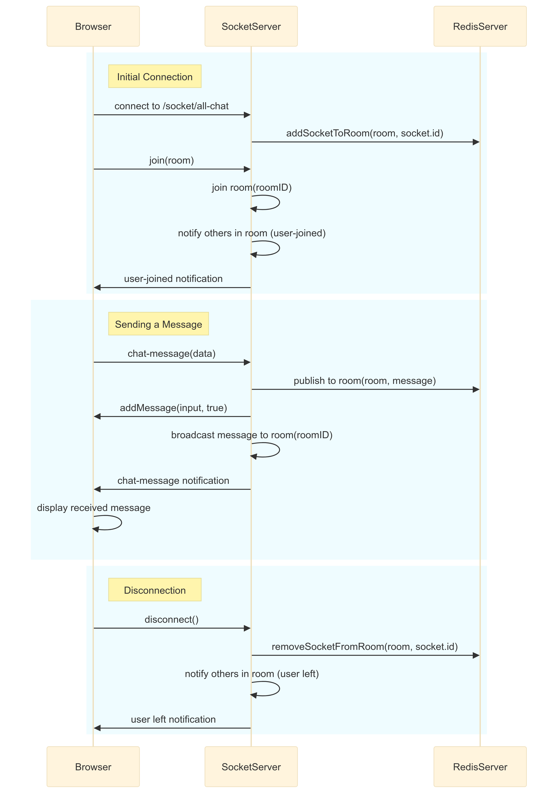

# ChatWebapp

Entwicklung einer P2P-basierten Chat-Webanwendung mit React und Express.

## Kurzbeschreibung

Dieses Projekt zielt darauf ab, eine Chat-Webanwendung zu entwickeln, die Peer-to-Peer-Kommunikation unterstützt. Die Anwendung ermöglicht normale Chats sowie Gruppenchats mit zusätzlicher Unterstützung für anonyme Kommunikation. Die Implementierung erfolgt mithilfe von Express und React in einer Docker Umgebung.

## Features

- **User Accounts:** Benutzer können Konten erstellen und sich anmelden.
- **Normaler Chat:** Einzelne Benutzer können miteinander chatten.
- **Gruppenchat:** Alle Benutzer können in einem All-Chat chatten.
- **Anonymer Chat:** Option für anonyme Kommunikation zwischen Benutzern.

## Installation und Ausführung

Um die Webanwendung in einer Docker-Umgebung auszuführen, folge diesen Schritten:

1. Stelle sicher, dass Docker auf deinem System installiert ist.

2. Navigiere in das Root-Verzeichnis des Projekts.

4. Kopiere den Inhalt von .env_example in eine neue Datei .env.

5. Führe den folgenden Befehl aus, um die Webanwendung mit Docker Compose zu starten:

   ```bash
   docker-compose up

6. Die Webapp ist unter dem NGINX Port erreichbar (Standardkonfig: 4000)

## Architektur
#### Overview

#### Peer to Peer State Diagramm

#### All Chat (Client Server Chat)
